# 🔍 PokéSearch - Advanced Pokémon Database System

<div align="center">


**A full-stack web application for exploring comprehensive Pokémon data with Oracle 11g backend and modern JavaScript frontend**

[](https://www.oracle.com/database/technologies/xe-prior-releases.html)
[](https://www.python.org/)
[](https://flask.palletsprojects.com/)
[](https://www.docker.com/)
[](https://developer.mozilla.org/en-US/docs/Web/JavaScript)

[Features](#-features) • [Screenshots](#-screenshots) • [Quick Start](#-quick-start) • [Tech Stack](#-technology-stack) • [Documentation](#-documentation)

</div>

---

## 📋 Table of Contents

- [Overview](#-overview)
- [Features](#-features)
- [Screenshots](#-screenshots)
- [Quick Start](#-quick-start)
- [Technology Stack](#-technology-stack)
- [Project Structure](#-project-structure)
- [Database Architecture](#-database-architecture)
- [Installation Methods](#-installation-methods)
- [Docker Deployment](#-docker-deployment)
- [Ngrok Integration](#-ngrok-integration)
- [API Documentation](#-api-documentation)
- [Future Enhancements](#-future-enhancements)

---

## 🌟 Overview

**PokéSearch** is a comprehensive web-based Pokémon information system that provides an intuitive interface for searching, filtering, and exploring detailed information about all Pokémon. Built with Oracle 11g database, Flask REST API, and vanilla JavaScript, this application demonstrates full-stack development with enterprise-grade database management.

### Key Highlights

✅ **Complete Pokémon Data** - All 8 generations with 1000+ Pokémon  
✅ **Advanced Filtering** - 15+ filter options including name patterns, stats ranges, abilities  
✅ **Interactive Evolution Trees** - Visual representation with evolution requirements  
✅ **Type Effectiveness** - Complete offensive/defensive matchup calculations  
✅ **Responsive Design** - Works flawlessly on desktop, tablet, and mobile devices  
✅ **Docker Ready** - One-command deployment with docker-compose  
✅ **API Fallback** - Automatic switching between localhost and ngrok endpoints  
✅ **Real-time Search** - Instant results as you type with no page reload  

---

## ⚡ Features

### 🔎 Advanced Search & Filtering

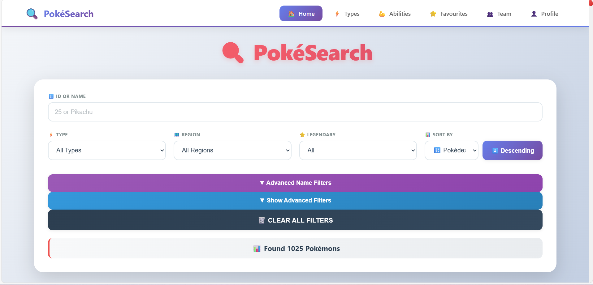

**Basic Filters:**
- 🔢 **ID/Name Search** - Search by Pokédex number or name
- ⚡ **Type Filter** - Filter by any of 18 Pokémon types
- 🗺️ **Region Filter** - Browse by Kanto, Johto, Hoenn, Sinnoh, Unova, Kalos, Alola, Galar
- 🎮 **Generation Filter** - Select specific generations (1-8)
- ⭐ **Legendary Filter** - Show only legendary or non-legendary Pokémon

**Advanced Name Filters:**
- ▶️ **Starts With** - Find Pokémon starting with specific letter
- 🔍 **Includes Letters** - Must contain certain letters
- 🚫 **Excludes** - Cannot contain specified letters
- 📍 **Position Match** - Specific characters at positions (e.g., `_ i _ a _ _`)
- 📏 **Name Length** - Filter by exact name length

**Advanced Filters:**
- 🔄 **Evolution Stage** - Basic, mid-evolution, or final forms
- 📊 **BST Range** - Filter by total base stats (min/max)
- 📏 **Height Range** - Physical height filtering
- ⚖️ **Weight Range** - Physical weight filtering
- 💪 **Ability Search** - Find Pokémon with specific abilities
- 🎯 **Catch Difficulty** - Easy (100+), Medium (50-99), Hard (0-49)
- 🔀 **Dual-Type Only** - Show only Pokémon with two types

### 📊 Sorting Options (Ascending/Descending)

- 🔢 **Pokédex ID** 
- 🔤 **Name** (A-Z or Z-A)
- ❤️ **HP, Attack, Defense, Sp. Atk, Sp. Def, Speed**
- 💪 **Total Base Stats (BST)**
- 📏 **Height and Weight**
- 🎣 **Catch Rate**

### 📱 Pokémon Details Page

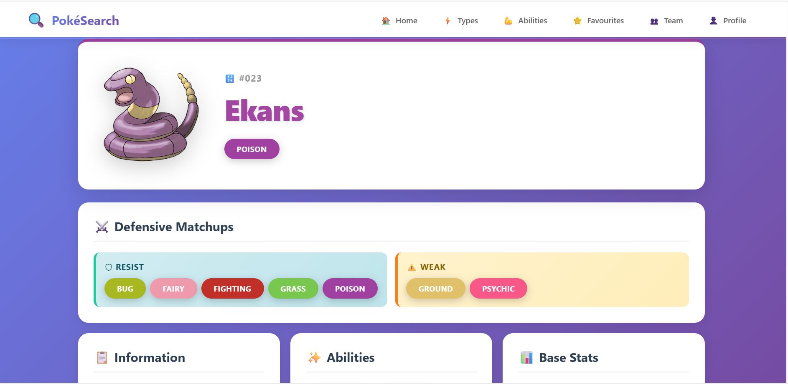

- **Complete Stats Display** with animated progress bars
- **Type Information** with color-coded clickable badges
- **Abilities List** with descriptions and hover tooltips
- **Physical Characteristics**: Height, Weight, BMI, Catch Rate
- **Generation & Region** information
- **Pokédex Description**
- **Type Effectiveness Calculator** showing:
  - Immune types (0x damage)
  - Very Resistant (0.25x damage)
  - Resistant (0.5x damage)
  - Weak (2x damage)
  - Very Weak (4x damage)
- **Interactive Evolution Chain**:
  - Visual tree structure
  - Evolution requirements (level, stones, items, trade, friendship)
  - Clickable sprites to navigate
  - Branching evolution support (Eevee, Tyrogue, etc.)

### 🎨 Type Explorer

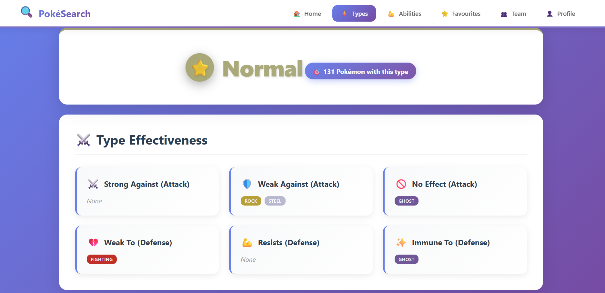

- Browse all 18 Pokémon types with custom icons
- View complete type effectiveness charts
- See all Pokémon of each type (sorted by Pokédex ID)
- Offensive and defensive matchup visualizations
- Clickable type badges for easy navigation

### 💪 Ability Browser

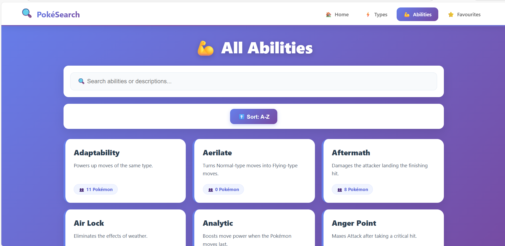

- Complete ability database (300+ abilities)
- Searchable by name or description
- View all Pokémon with each ability (sorted by ID)
- Detailed ability descriptions
- Sortable A-Z or Z-A

---

## 📸 Screenshots

<table>
<tr>
<td width="50%">

### Main Search Interface (Desktop)
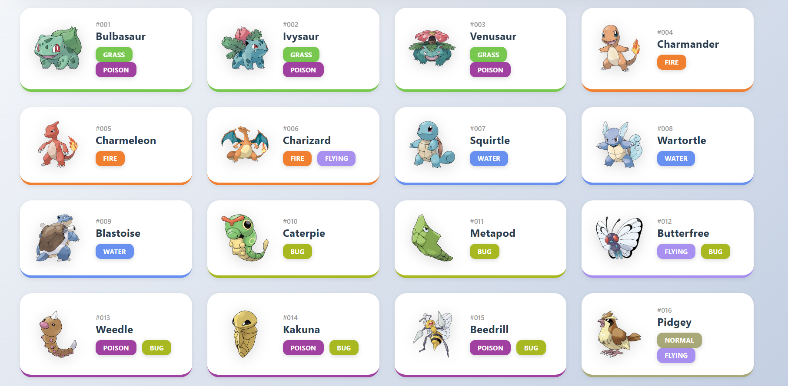
*Advanced filtering with real-time results*

</td>
<td width="50%">

### Search Results Grid
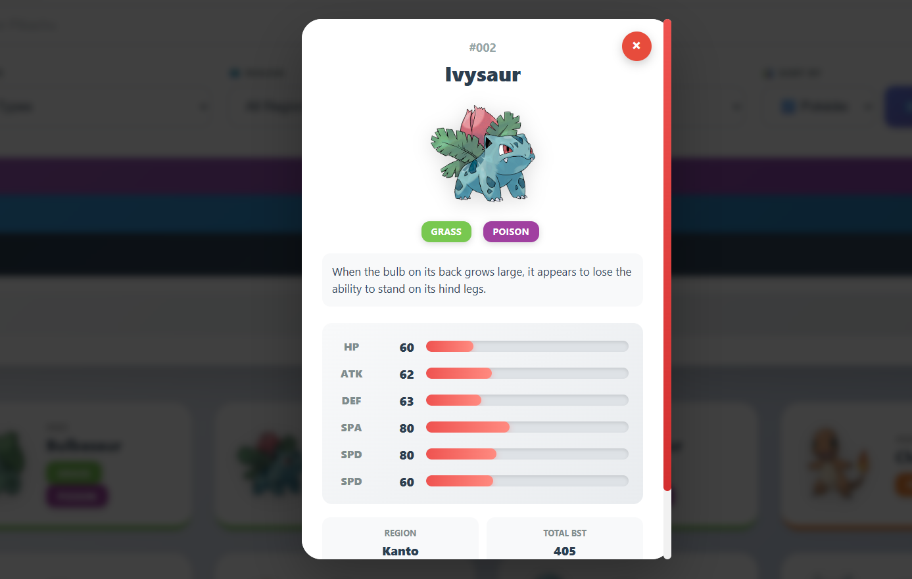
*Pokémon displayed in responsive card layout*

</td>
</tr>
<tr>
<td width="50%">

### Pokémon Details View
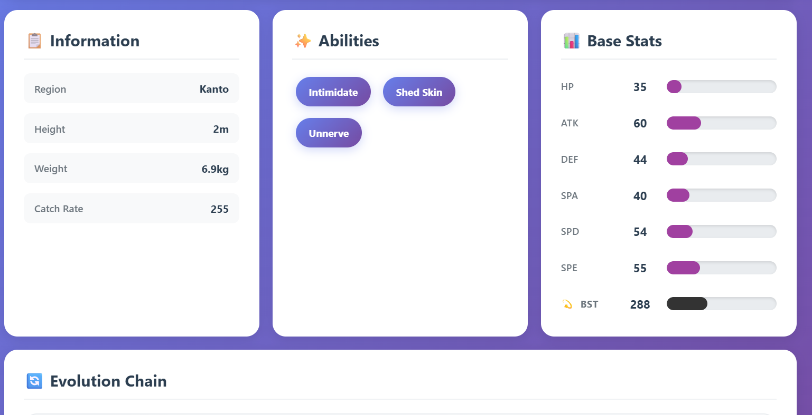
*Complete information with stats and abilities*

</td>
<td width="50%">

### Evolution Chain Display
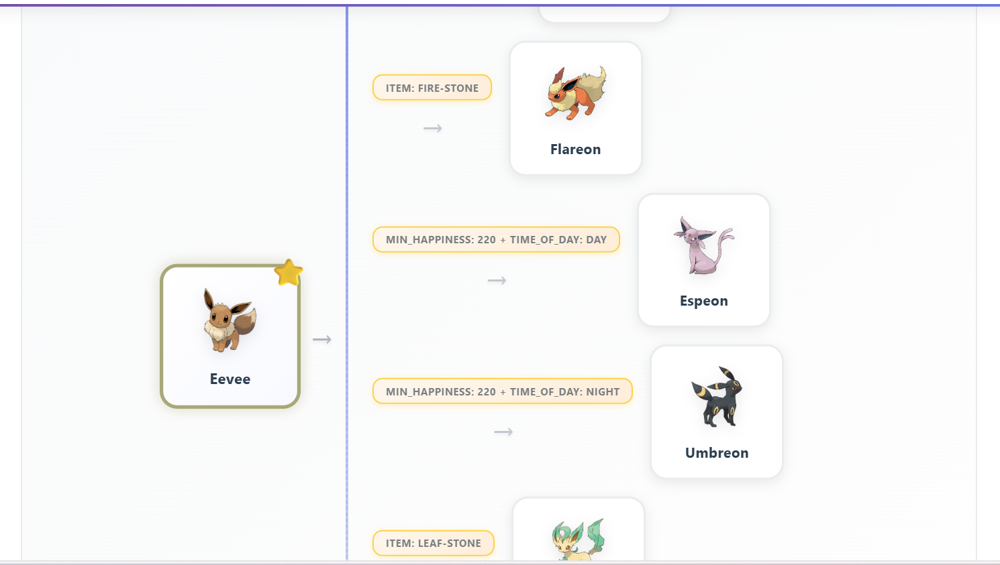
*Interactive evolution tree with requirements*

</td>
</tr>
<tr>
<td width="50%">

### Type Effectiveness Page
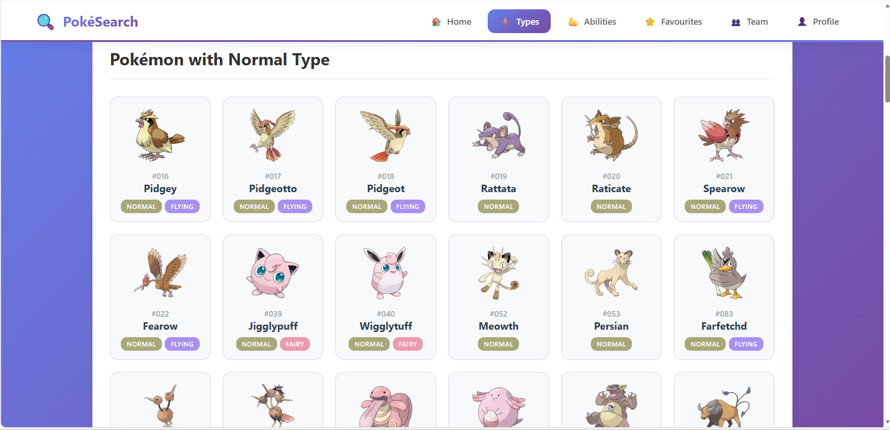
*Visual type matchups for Normal type*

</td>
<td width="50%">

### Type Pokémon Listing
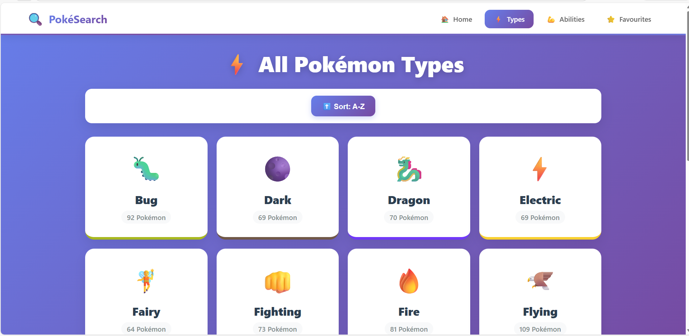
*All Normal-type Pokémon displayed*

</td>
</tr>
<tr>
<td width="50%">

### Abilities Overview
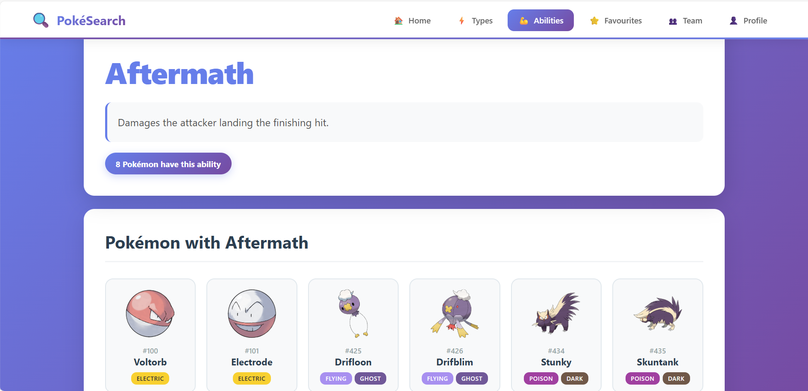
*Searchable ability database with descriptions*

</td>
<td width="50%">

### Ability Details
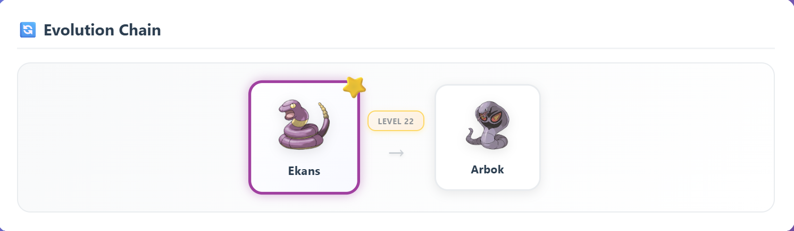
*Detailed stats and information sections*

</td>
</tr>
</table>

### Mobile Responsive Design

<table>
<tr>
<td width="33%">

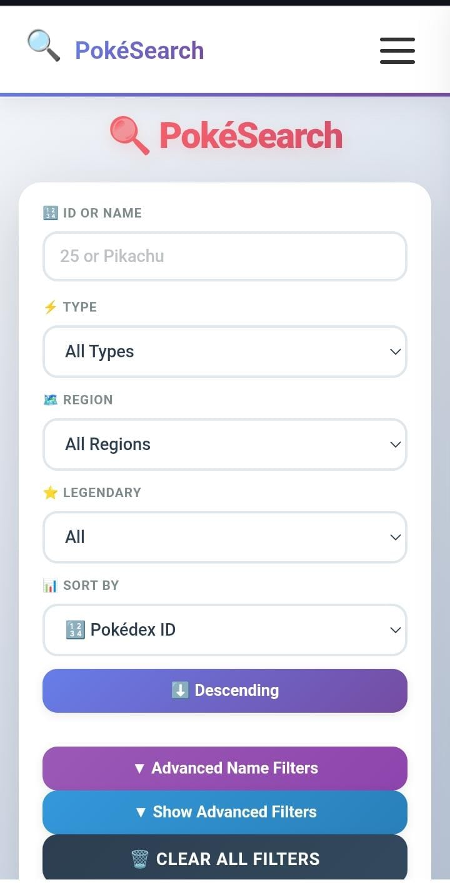
*Mobile search interface*

</td>
<td width="33%">

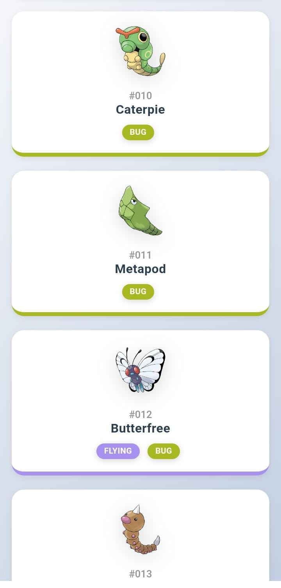
*Mobile Pokémon cards*

</td>
<td width="33%">

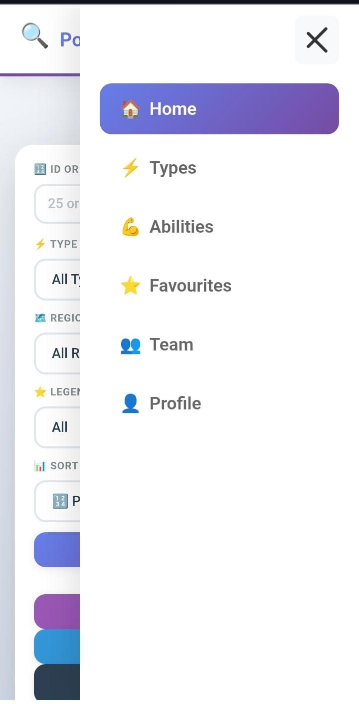
*Mobile navigation menu*

</td>
</tr>
</table>

*Fully responsive design optimized for mobile devices*

---

## 🚀 Quick Start

### Option 1: Docker (Recommended - Easiest)

```bash
# 1. Clone repository
git clone https://github.com/hamza05-dot/PokemonGame.git
cd PokemonGame
# 2. Start all services
docker-compose up -d --build

# 3. Import database
./import_data.bat  # Windows
./import_data.sh   # Linux/Mac

# 4. Access application
# Open browser: http://localhost
```

### Option 2: Local Development

```bash
# 1. Setup Oracle Database
sqlplus sys/password@xe as sysdba
CREATE USER pokedb IDENTIFIED BY 5687;
GRANT CONNECT, RESOURCE, DBA TO pokedb;
EXIT;

# 2. Import schema
sqlplus pokedb/5687@xe
@sql/pokedb.sql
EXIT;

# 3. Start backend
cd backend
pip install -r requirements.txt
python app.py

# 4. Start frontend
cd frontend
python -m http.server 8000
```

**Access:** http://localhost:8000

---

## 🛠 Technology Stack

### Backend Technologies

| Technology | Version | Purpose |
|-----------|---------|---------|
| **Python** | 3.8+ | Backend programming language |
| **Flask** | 3.1.2 | Web framework & REST API server |
| **Flask-CORS** | 6.0.2 | Cross-origin resource sharing |
| **python-oracledb** | 3.4.2 | Oracle database driver (thick mode) |
| **Oracle Database** | 11g XE | Enterprise relational database |
| **python-dotenv** | 1.0.1 | Environment variable management |

### Frontend Technologies

| Technology | Version | Purpose |
|-----------|---------|---------|
| **HTML5** | - | Semantic structure |
| **CSS3** | - | Styling with animations |
| **JavaScript** | ES6+ | Client-side logic and interactivity |
| **Fetch API** | - | Asynchronous HTTP requests |

### DevOps & Deployment

| Technology | Version | Purpose |
|-----------|---------|---------|
| **Docker** | Latest | Container platform |
| **Docker Compose** | v3.8 | Multi-container orchestration |
| **Nginx** | Alpine | Web server & reverse proxy |
| **Ngrok** | Latest | Secure tunneling service |

### Development Tools

- **Git** - Version control system
- **VS Code** - Code editor
- **Postman** - API testing tool
- **SQL Developer** - Oracle database management
- **Chrome DevTools** - Frontend debugging

---

## 📁 Project Structure

```
pokemon-search/
│
├── 📂 docs/                          # Documentation
│   └── 📂 images/                    # Screenshots & diagrams
│       ├── banner.png
│       ├── database-schema.png       # ER diagram
│       ├── search-interface*.png     # Search UI screenshots
│       ├── details-page*.png         # Details page screenshots
│       ├── type-page*.png            # Type page screenshots
│       ├── abilities-page*.png       # Abilities page screenshots
│       ├── screenshot-*.png/jpeg     # Mobile & other screenshots
│       └── screenshot-evolution.png  # Evolution tree
│
├── 📂 backend/                       # Flask API Server
│   ├── app.py                        # Main application
│   ├── requirements.txt              # Dependencies
│   └── Dockerfile                    # Container config
│
├── 📂 frontend/                      # Web Interface
│   ├── *.html                        # HTML pages
│   ├── *.css                         # Stylesheets
│   ├── *.js                          # JavaScript
│   ├── nginx.conf                    # Web server config
│   └── Dockerfile                    # Container config
│
├── 📂 sql/                           # Database Scripts
│   └── pokedb.sql                    # Schema & data
│
├── 📂 database/                      # Backups
│   └── pokemon_backup.dmp            # Oracle export
│
├── docker-compose.yml                # Orchestration
├── .env                              # Environment variables
├── .gitignore                        # Git ignore rules
├── .dockerignore                     # Docker ignore rules
├── import_data.bat                   # Data import (Windows)
├── README.md                         # This file
└── LICENSE                           # MIT License
```

**For detailed structure:** See [PROJECT_STRUCTURE.md](./PROJECT_STRUCTURE.md)

---

## 🗄 Database Architecture

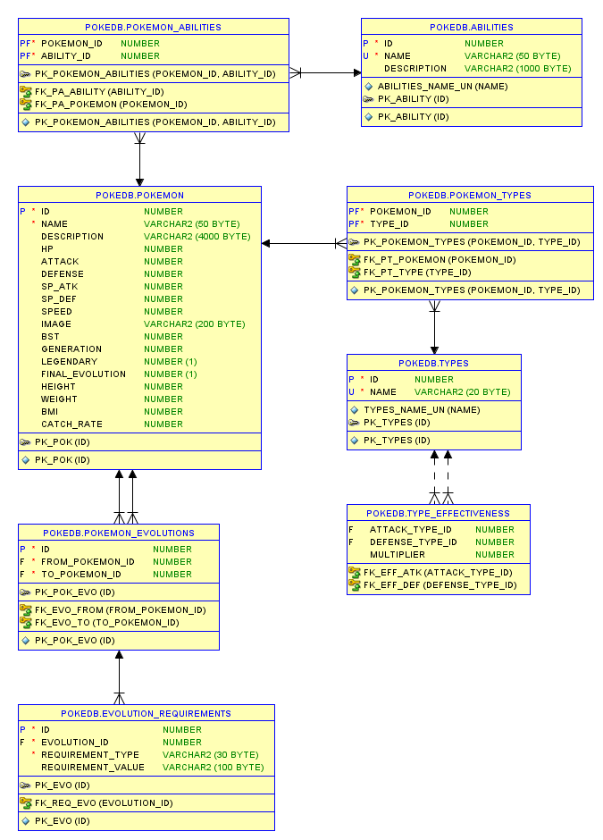

### Tables (8 Total)

| Table | Records | Purpose |
|-------|---------|---------|
| **POKEMON** | 1000+ | Core Pokémon data (stats, generation, legendary) |
| **TYPES** | 18 | Type definitions (Fire, Water, Grass, etc.) |
| **POKEMON_TYPES** | 1500+ | Maps Pokémon to their types (supports dual-types) |
| **ABILITIES** | 300+ | Ability definitions and descriptions |
| **POKEMON_ABILITIES** | 2000+ | Maps Pokémon to their abilities |
| **POKEMON_EVOLUTIONS** | 500+ | Evolution chains with requirements |
| **EVOLUTION_REQUIREMENTS** | 200+ | Evolution methods (level, stone, trade, etc.) |
| **TYPE_EFFECTIVENESS** | 324 | Type matchup multipliers (18×18 matrix) |

### Key Features

✅ **Normalized Design** - 3NF compliance with minimal redundancy  
✅ **Primary Keys** - All tables use `ID` as primary key  
✅ **Foreign Keys** - Referential integrity enforced  
✅ **Junction Tables** - Many-to-many relationships (types, abilities)  
✅ **Recursive Relationships** - Evolution chains support branching  
✅ **Indexing** - Optimized queries on name, type, generation  
✅ **Constraints** - Data validation with check constraints  
✅ **VARCHAR2** - Unicode support for international names  

### Entity Relationships

```
POKEMON (1) ──────< (M) POKEMON_TYPES (M) >────── (1) TYPES
   │
   ├─────────< (M) POKEMON_ABILITIES (M) >─────── (1) ABILITIES
   │
   └─────────< (M) POKEMON_EVOLUTIONS
                       │
                       └──────> (1) EVOLUTION_REQUIREMENTS

TYPES (1) ──────< (M) TYPE_EFFECTIVENESS (M) >──── (1) TYPES
(Attack)                                         (Defense)
```

### Sample Queries

**Find all Electric-type Pokémon:**
```sql
SELECT p.* 
FROM POKEMON p
JOIN POKEMON_TYPES pt ON p.id = pt.pokemon_id
JOIN TYPES t ON pt.type_id = t.id
WHERE t.name = 'Electric';
```

**Get evolution chain for Pikachu (ID 25):**
```sql
WITH RECURSIVE evo_chain AS (
  SELECT * FROM POKEMON_EVOLUTIONS WHERE from_pokemon_id = 25
  UNION ALL
  SELECT e.* FROM POKEMON_EVOLUTIONS e
  JOIN evo_chain ec ON e.from_pokemon_id = ec.to_pokemon_id
)
SELECT * FROM evo_chain;
```

**Type effectiveness for Fire attacks:**
```sql
SELECT t.name AS defending_type, te.multiplier
FROM TYPE_EFFECTIVENESS te
JOIN TYPES t ON te.defense_type_id = t.id
WHERE te.attack_type_id = (SELECT id FROM TYPES WHERE name = 'Fire')
ORDER BY te.multiplier DESC;
```

---

## 💻 Installation Methods

### Method 1: Docker Compose (Recommended)

**Prerequisites:**
- Docker Desktop 20.10+
- Docker Compose 1.29+
- 4GB RAM minimum

**Steps:**

1. **Clone Repository**
   ```bash
   git clone https://github.com/yourusername/pokemon-search.git
   cd pokemon-search
   ```

2. **Configure Environment**
   ```bash
   # Create .env file
   cp .env.example .env
   
   # Edit .env (optional)
   ORACLE_PASSWORD=your_password
   FLASK_PORT=5000
   NGINX_PORT=80
   ```

3. **Start Services**
   ```bash
   docker-compose up -d
   ```

4. **Import Database**
   ```bash
   # Windows
   .\import_data.bat
   
   # Linux/Mac
   chmod +x import_data.sh
   ./import_data.sh
   ```

5. **Verify Installation**
   ```bash
   # Check all containers running
   docker-compose ps
   
   # View logs
   docker-compose logs -f
   ```

6. **Access Application**
   - Frontend: http://localhost
   - API: http://localhost:5000/api

**Docker Architecture:**
```
┌─────────────┐      ┌─────────────┐      ┌─────────────┐
│   Nginx     │─────>│   Flask     │─────>│   Oracle    │
│  (Port 80)  │      │  (Port 5000)│      │  (Port 1521)│
└─────────────┘      └─────────────┘      └─────────────┘
   Frontend            REST API            Database
```

**Useful Commands:**
```bash
# Stop all services
docker-compose down

# Rebuild after code changes
docker-compose up -d --build

# View logs for specific service
docker-compose logs -f flask-api

# Execute SQL in Oracle container
docker exec -it oracle-db sqlplus pokedb/5687@xe

# Backup database
docker exec oracle-db exp pokedb/5687 file=backup.dmp full=y
```

---

### Method 2: Local Development

**Prerequisites:**
- Python 3.8+
- Oracle Database 11g XE
- Oracle Instant Client 21.3+

**Backend Setup:**

1. **Install Oracle Database**
   - Download Oracle 11g XE from Oracle website
   - Install with default settings
   - Note the SID (usually `XE`)

2. **Create Database User**
   ```sql
   sqlplus sys/password@xe as sysdba
   
   CREATE USER pokedb IDENTIFIED BY 5687;
   GRANT CONNECT, RESOURCE, DBA TO pokedb;
   GRANT CREATE SESSION TO pokedb;
   GRANT UNLIMITED TABLESPACE TO pokedb;
   EXIT;
   ```

3. **Import Schema & Data**
   ```bash
   sqlplus pokedb/5687@xe @sql/pokedb.sql
   ```

4. **Install Python Dependencies**
   ```bash
   cd backend
   pip install -r requirements.txt
   ```

5. **Configure Oracle Client**
   ```python
   # In app.py, update:
   oracledb.init_oracle_client(
       lib_dir=r"C:\oracle\instantclient_21_3"  # Windows
       # lib_dir="/usr/lib/oracle/21/client64/lib"  # Linux
   )
   ```

6. **Start Flask Server**
   ```bash
   python app.py
   # Server runs on http://localhost:5000
   ```

**Frontend Setup:**

1. **Navigate to Frontend**
   ```bash
   cd frontend
   ```

2. **Start HTTP Server**
   ```bash
   # Python 3
   python -m http.server 8000
   
   # Python 2
   python -m SimpleHTTPServer 8000
   
   # Node.js
   npx http-server -p 8000
   ```

3. **Access Application**
   - Open browser: http://localhost:8000

---

### Method 3: Production Deployment

**Using Nginx + Gunicorn:**

1. **Install Gunicorn**
   ```bash
   pip install gunicorn
   ```

2. **Start Gunicorn**
   ```bash
   gunicorn -w 4 -b 0.0.0.0:5000 app:app
   ```

3. **Configure Nginx**
   ```nginx
   server {
       listen 80;
       server_name yourdomain.com;
       
       location / {
           root /var/www/pokemon-search/frontend;
           try_files $uri $uri/ /index.html;
       }
       
       location /api {
           proxy_pass http://localhost:5000;
           proxy_set_header Host $host;
           proxy_set_header X-Real-IP $remote_addr;
       }
   }
   ```

4. **Enable Site**
   ```bash
   sudo ln -s /etc/nginx/sites-available/pokemon /etc/nginx/sites-enabled/
   sudo nginx -t
   sudo systemctl reload nginx
   ```

5. **Setup SSL (Optional)**
   ```bash
   sudo certbot --nginx -d yourdomain.com
   ```

---

## 🌐 Docker Deployment

### Architecture

```
┌──────────────────────────────────────────────────────┐
│                  Docker Network                      │
│  ┌────────────┐  ┌────────────┐  ┌───────────────┐  │
│  │   nginx    │  │  flask-api │  │  oracle-db    │  │
│  │  (Alpine)  │  │  (Python)  │  │  (11g XE)     │  │
│  │  Port: 80  │  │  Port:5000 │  │  Port: 1521   │  │
│  └─────┬──────┘  └─────┬──────┘  └───────┬───────┘  │
│        │                │                  │          │
│        └────────────────┴──────────────────┘          │
└──────────────────────────────────────────────────────┘
         ▲
         │ Port Mapping
         │
    [Host Machine]
```


**1. Oracle Database Container**
- Image: `oracleinanutshell/oracle-xe-11g`
- Memory: 2GB
- Startup Time: ~60 seconds
- Persistent Volume: `/u01/app/oracle`

**2. Flask API Container**
```dockerfile
FROM python:3.9-slim
WORKDIR /app
COPY requirements.txt .
RUN pip install --no-cache-dir -r requirements.txt
COPY . .
EXPOSE 5000
CMD ["python", "app.py"]
```

**3. Nginx Container**
```dockerfile
FROM nginx:alpine
COPY . /usr/share/nginx/html
COPY nginx.conf /etc/nginx/conf.d/default.conf
EXPOSE 80
CMD ["nginx", "-g", "daemon off;"]
```

### Management Commands

**Start Services:**
```bash
# Start in detached mode
docker build 
docker-compose up -d

# Start with logs
docker-compose up

# Rebuild images
docker-compose up -d --build
```

**Stop Services:**
```bash
# Stop containers
docker-compose stop

# Stop and remove containers
docker-compose down

# Remove volumes too
docker-compose down -v
```

**View Logs:**
```bash
# All services
docker-compose logs -f

# Specific service
docker-compose logs -f flask-api

# Last 100 lines
docker-compose logs --tail=100
```

**Execute Commands:**
```bash
# Access Oracle SQL*Plus
docker exec -it oracle-db sqlplus pokedb/5687@xe

# Access Flask container bash
docker exec -it flask-api /bin/bash

# Import data to Oracle
docker cp sql/pokedb.sql oracle-db:/tmp/
docker exec -it oracle-db sqlplus pokedb/5687@xe @/tmp/pokedb.sql
```

**Monitor Resources:**
```bash
# Container stats
docker stats

# Inspect container
docker inspect oracle-db

# View volumes
docker volume ls
```

### Troubleshooting

**Container Health Checks:**
```bash
# Check all containers
docker-compose ps

# Expected output:
NAME         STATUS    PORTS
oracle-db    Up        0.0.0.0:1521->1521/tcp
flask-api    Up        0.0.0.0:5000->5000/tcp
nginx        Up        0.0.0.0:80->80/tcp
```

**Common Issues:**

1. **Oracle not starting:**
   ```bash
   # Check memory (needs 2GB)
   docker stats oracle-db
   
   # View logs
   docker logs oracle-db
   ```

2. **Flask API connection errors:**
   ```bash
   # Verify Oracle is ready
   docker exec oracle-db lsnrctl status
   
   # Test connection
   docker exec flask-api curl http://localhost:5000/api/pokemon
   ```

3. **Nginx 502 errors:**
   ```bash
   # Check Flask is running
   docker ps | grep flask-api
   
   # Test backend
   curl http://localhost:5000/api/pokemon
   ```

---

## 🔒 Ngrok Integration

### Overview

Ngrok creates secure tunnels to expose local servers to the internet, perfect for:
- Testing on mobile devices
- Sharing with clients/team
- Webhook development
- API demos

### Setup

**1. Install Ngrok:**
```bash
# Download from ngrok.com
# Or use package manager:

# Windows (Chocolatey)
choco install ngrok

# macOS
brew install ngrok/ngrok/ngrok

# Linux
snap install ngrok
```

**2. Authenticate:**
```bash
ngrok config add-authtoken YOUR_TOKEN_HERE
```

**3. Start Tunnel:**
```bash
# Basic HTTP tunnel
ngrok http 5000

# With custom domain (paid)
ngrok http 5000 --domain=pokemon.ngrok.io

# Multiple tunnels (ngrok.yml)
ngrok start --all
```

### Configuration File

**ngrok.yml:**
```yaml
version: "2"
authtoken: YOUR_TOKEN_HERE

tunnels:
  flask-api:
    proto: http
    addr: 5000
    inspect: true
  
  frontend:
    proto: http
    addr: 80
    inspect: true
```

**Start multiple tunnels:**
```bash
ngrok start flask-api frontend
```

### Frontend Integration

**Automatic Endpoint Detection:**
```javascript
// config.js
const API_CONFIG = {
  // Try ngrok first (set by user)
  ngrok: localStorage.getItem('NGROK_URL'),
  
  // Fallback to localhost
  local: 'http://localhost:5000/api',
  
  // Get active endpoint
  get endpoint() {
    return this.ngrok || this.local;
  }
};

// Usage
fetch(`${API_CONFIG.endpoint}/pokemon`)
  .then(res => res.json())
  .catch(err => {
    // Try fallback
    if (API_CONFIG.ngrok) {
      API_CONFIG.ngrok = null;
      location.reload();
    }
  });
```

**UI for ngrok URL:**
```html
<!-- In index.html -->
<div id="settings">
  <label>Ngrok URL (optional):</label>
  <input 
    type="text" 
    id="ngrok-url" 
    placeholder="https://abc123.ngrok-free.app/api"
  />
  <button onclick="saveNgrokUrl()">Save</button>
</div>

<script>
function saveNgrokUrl() {
  const url = document.getElementById('ngrok-url').value;
  localStorage.setItem('NGROK_URL', url);
  location.reload();
}
</script>
```

### Features & Limits

**Free Tier:**
- ✅ 1 online ngrok process
- ✅ 4 tunnels per process
- ✅ HTTP/HTTPS tunnels
- ✅ Random URLs
- ⚠️ 40 connections/minute

**Paid Tier Benefits ($):**
- 🔗 Custom subdomain (e.g., `pokemon.ngrok.io`)
- ♾️ No connection limits
- 📊 Advanced analytics

---

## 📡 API Documentation

### Base URL

```
Local:  http://localhost:5000/api
Ngrok:  https://your-ngrok-url.ngrok-free.app/api
```

### Endpoints

#### 1. Get All Pokémon

```http
GET /api/pokemon
```

**Response:**
```json
[
  {
    "id": 1,
    "name": "bulbasaur",
    "type1": "Grass",
    "type2": "Poison",
    "hp": 45,
    "attack": 49,
    "defense": 49,
    "sp_atk": 65,
    "sp_def": 65,
    "speed": 45,
    "bst": 318,
    "generation": 1,
    "legendary": 0,
    "height": 0.7,
    "weight": 6.9,
    "catch_rate": 45,
    "abilities": "Overgrow, Chlorophyll"
  }
]
```

#### 2. Get Pokémon by ID

```http
GET /api/pokemon/:id
```

**Example:** `GET /api/pokemon/25`

**Response:**
```json
{
  "id": 25,
  "name": "pikachu",
  "type1": "Electric",
  "type2": null,
  "description": "When several of these POKéMON gather...",
  "evolution_chain": {
    "id": 172,
    "name": "pichu",
    "evolutions": [
      {
        "id": 25,
        "name": "pikachu",
        "requirement": "Friendship",
        "evolutions": [
          {
            "id": 26,
            "name": "raichu",
            "requirement": "Thunder Stone"
          }
        ]
      }
    ]
  },
  "type_effectiveness": {
    "defensive": {
      "multipliers": {
        "ground": 2,
        "electric": 0.5,
        "flying": 0.5,
        "steel": 0.5
      }
    }
  }
}
```

#### 3. Get All Types

```http
GET /api/types
```

**Response:**
```json
[
  {
    "id": 1,
    "name": "Normal",
    "pokemon_count": 98
  },
  {
    "id": 2,
    "name": "Fire",
    "pokemon_count": 64
  }
]
```

#### 4. Get Type Details

```http
GET /api/types/:name
```

**Example:** `GET /api/types/fire`

#### 5. Get All Abilities

```http
GET /api/abilities
```

#### 6. Get Ability Details

```http
GET /api/abilities/:id
```

**Example:** `GET /api/abilities/65`

### Error Responses

```json
{
  "error": "Pokémon not found"
}
```

**Status Codes:**
- `200` - Success
- `404` - Resource not found
- `500` - Server error

---

## 🔮 Future Enhancements

### Phase 1: User Features

- [ ] **User Authentication**
  - JWT-based login/signup
  - User profiles
  - Session management

- [ ] **Favourites System**
  - Save favorite Pokémon
  - Create custom lists
  - Share lists with others

- [ ] **Team Builder**
  - Create teams of 6
  - Type coverage analysis
  - Weakness calculator
  - Save multiple teams

### Phase 2: Enhanced Data

- [ ] **Move Database**
  - All Pokémon moves
  - Move details (power, accuracy, PP)
  - Learn methods (level, TM, egg)
  - Move effectiveness calculator

- [ ] **Battle Simulator**
  - Turn-based battles
  - Damage calculator
  - AI opponent
  - Battle history

### Phase 3: Advanced Features

- [ ] **Pokémon Comparison**
  - Side-by-side stats
  - Type matchup comparison
  - Visual charts

- [ ] **Nature & IV Calculator**
  - Nature effects on stats
  - IV calculator
  - EV tracking

- [ ] **Shiny Variants**
  - Shiny sprite display
  - Shiny odds calculator
  - Shiny tracking

### Phase 4: Technical Improvements

- [ ] **Progressive Web App (PWA)**
  - Offline functionality
  - Install as app
  - Push notifications

- [ ] **Performance Optimization**
  - Redis caching
  - CDN for images
  - API response compression

- [ ] **GraphQL API**
  - Flexible queries
  - Reduced over-fetching

- [ ] **Internationalization**
  - Multi-language support
  - Localized names

---

## 🔧 Troubleshooting

### Common Issues

#### Oracle Connection Errors

**"DPI-1047: Cannot locate Oracle Client library"**

```bash
# Solution: Update lib_dir in app.py
oracledb.init_oracle_client(lib_dir="/path/to/instantclient")
```

**"ORA-12541: TNS:no listener"**

```bash
# Check Oracle service
lsnrctl status

# Start if stopped
lsnrctl start
```

#### Docker Issues

**Containers won't start:**

```bash
# Check logs
docker-compose logs -f

# Recreate containers
docker-compose down
docker-compose up -d --build
```

**Database connection timeout:**

```bash
# Oracle takes 1-2 minutes to initialize
# Wait and check logs
docker-compose logs -f oracle-db
```

#### Frontend Issues

**API not loading:**

1. Verify backend: `curl http://localhost:5000/api/pokemon`
2. Check CORS in app.py: `CORS(app)`
3. Open browser console (F12) for errors

---

## 📄 License

This project is licensed under the MIT License.

### Acknowledgments

- **Nintendo/Game Freak** - Pokémon franchise
- **PokeAPI** - Sprite images
- **Oracle Database** - Enterprise database
- **Flask Community** - Web framework
- **Open Source Community** - Tools and libraries

---

## 📞 Contact

**Developer:** Hamza Arfaoui  
**Email:** arfaouihamzaa3@example.com  
**GitHub:** [@yourusername](https://github.com/hamza05-dot)  
**LinkedIn:** [your-profile](www.linkedin.com/in/hamza-arfaoui5)

### Project Links

🌐 **Live Demo:** https://hamza05-dot.github.io/PokemonGame/frontend/index

📁 **Repository:** https://github.com/hamza05-dot/PokemonGame  
🐛 **Issues:** https://github.com/hamza05-dot/PokemonGame/issues  

---

<div align="center">

**Made with ❤️ and ☕**

*Gotta query 'em all!* 🔍⚡

[](https://github.com/hamza05-dot/PokemonGame/stargazers)
[](https://github.com/hamza05-dot/PokemonGame/network/members)

</div>
